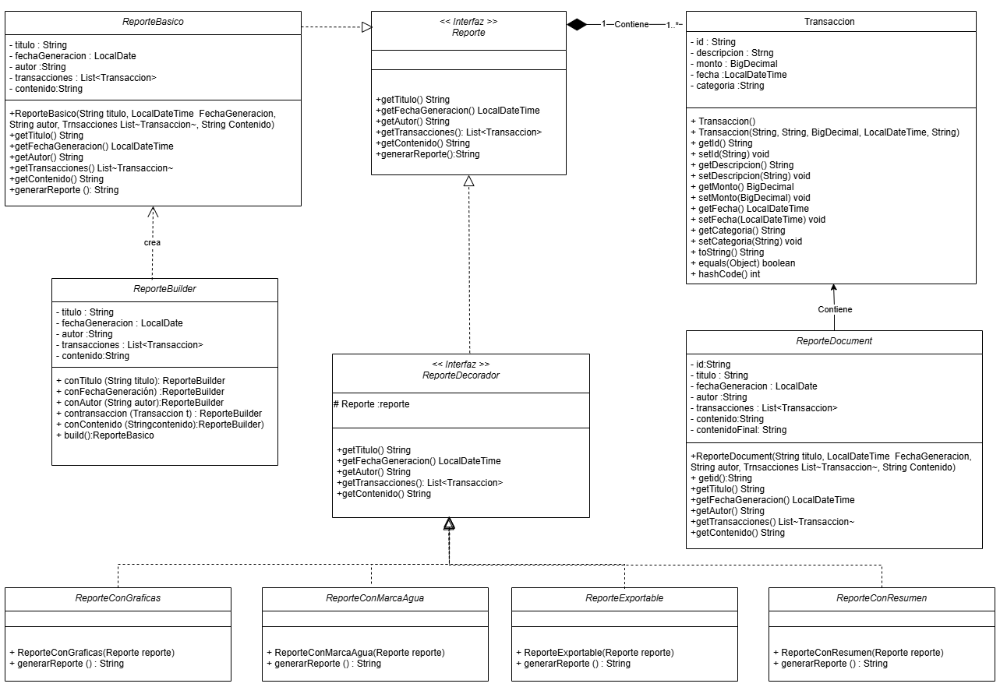
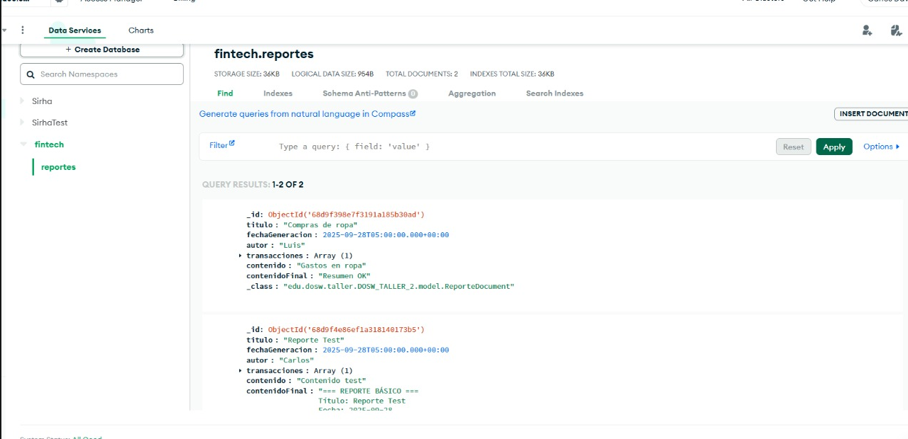
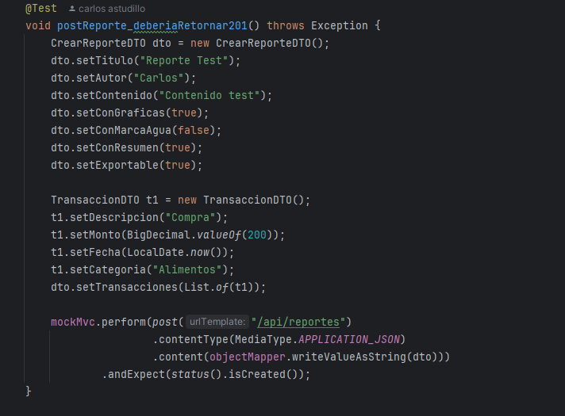
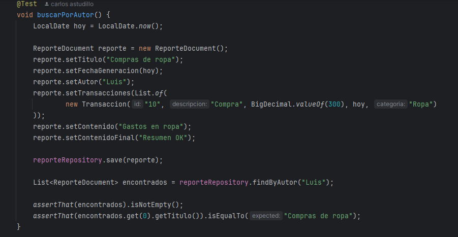
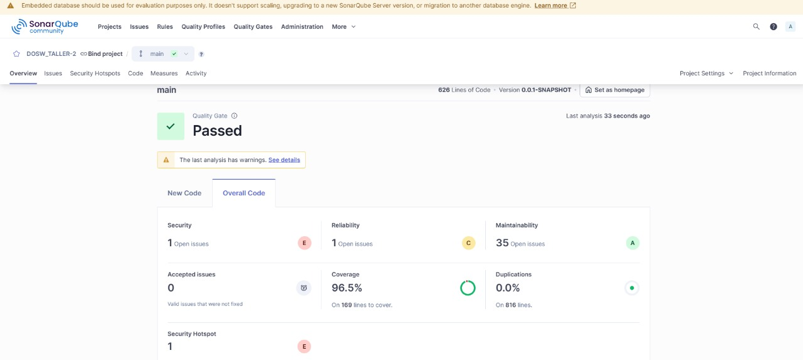

# DOSW_TALLER-2
#### Integrantes:
- Valeria Bermúdez Aguilar
- Juan Andrés Suárez Fonseca
- Samuel Leonardo Albarracín Vergara
- Carlos David Astudillo Castiblanco
- Ana Gabriela Fiqutiva Poveda
---
### Enunciado:
- Caso de estudio: GESTOR DE TAREAS COLABORATIVO
Una empresa fintech quiere desarrollar un Sistema de Reportes Financieros que permita generar informes dinámicos y 
personalizables para sus clientes.
El sistema debe permitir a los usuarios:
1.	Crear reportes con información básica: título, fecha de generación, autor, lista de transacciones y contenido.
2.	Extender dinámicamente los reportes con decoradores:
      - Reporte con gráficas.
      - Reporte con marcas de agua de seguridad.
      - Reporte con resumen estadístico.
      - Reporte con exportación a PDF/Excel.
3.	Usar el patrón Builder para construir los objetos Reporte paso a paso, asegurando flexibilidad en su creación.
4.	Listar todos los reportes generados y filtrar por fecha usando Streams.
5.	Persistir los reportes en MongoDB.
---
## Desarrollo:
### 1. Desarrollo de Ramas:
- Se creó la rama `main` para el código base.
- Se creo la rama develop para el desarrollo del ejercicio.
- Se crearon ramas feature/ParteInicial para la implementación inicial del taller.
- Se crearon ramas feature/model para la implementación de las clases bases (Modelo, Service y Controller).
### 2. Implementación de Diagrama de Componentes Específico:
Explicación del Diagrama de Componentes:
###  3. Diagrama de Clases:
   
Explicación del Diagrama de Clases:
- La interface `Reporte` representa el contrato común  para todos los tipos de reportes financieros con atributos como título, fecha de generación, autor, lista de transacciones y contenido.
- La clase `Transaccion` representa una transacción financiera con atributos como monto, fecha y descripción.
- La clase `ReporteBuilder` implementa el patrón Builder para construir intancias de `Reporte` de manera flexible y validando que no falte infromación necesaria.
- La clase `ReporteDecorator` es una clase abstracta que extiende `Reporte` y sirve como base para los decoradores específicos delegando las llamadas a sus métodos base y permitiendo sobrescribir
  solo el comportamiento que se desea extender.
- Las clases `ReporteConGraficas`, `ReporteConMarcaDeAgua`, `ReporteConResumen` y `ReporteExportable` son decoradores concretos que añaden funcionalidades específicas a los reportes .
- La clase `ReporteBasico` implementa la interface reporte y representa un reporte financiero básico representando un reporte financiero básico con sus atributos inmutables.

### 4. Implementación de los principios SOLID:
- **S**ingle Responsibility Principle (SRP): Cada clase tiene una única responsabilidad. Por ejemplo:
1. La clase `ReporteBuilder` se encarga únicamente de construir reportes.
2. Las clases `ReporteConGraficas`, `ReporteConMarcaDeAgua`, `ReporteConResumen` y `ReporteExportable` que son  decoradores se encargan de añadir funcionalidades específicas.
- **O**pen/Closed Principle (OCP): Las clases están abiertas para extensión pero cerradas para modificación. Se pueden agregar nuevas funcionalidades mediante la creación de nuevas clases que extienden las existentes.
1. La clase `ReporteDecorador` permite crear nuevos decoradores sin modificar las clases de reportes existentes.
- **L**iskov Substitution Principle (LSP): Las clases derivadas pueden sustituir a sus clases base sin alterar el comportamiento del programa.
1. Cualquier instancia de `ReporteConGraficas`, `ReporteConMarcaDeAgua`, `ReporteConResumen` o `ReporteExportable` puede ser utilizada en lugar de una instancia de `Reporte` sin afectar la funcionalidad.
- **I**nterface Segregation Principle (ISP): Las interfaces son específicas y no obligan a las clases a implementar métodos que no utilizan.
1. La interfaz `Reporte` define solo los métodos necesarios para los reportes financieros, evitando que las clases implementen métodos innecesarios.
- **D**ependency Inversion Principle (DIP): Las clases dependen de abstracciones y no de implementaciones concretas.
1. La clase `ReporteService` depende de la interfaz `ReporteRepository` en lugar de una implementación concreta, permitiendo cambiar la implementación del repositorio sin afectar el servicio.
### 5. Implementación de Patrones de Diseño:
#### Patrón Decorator:
El patrón Decorator se utiliza para añadir funcionalidades adicionales a los reportes sin modificar su estructura original. Es decir, que cada decorador toma un Reporte existente y extiende su comportamiento  y permite combinar funcionalidades de manera flexible.
Por ejemplo: un reporte con marca de agua + resumen + exportación.
#### Patrón Builder:
El patrón Builder se utiliza para construir objetos ReporteBasico de manera flexible y paso a paso, permitiendo la creación de reportes con diferentes configuraciones.
Debido a que el reporte tiene muchos atributos opcionales y obligatorios el builder garantiza que el objeto final sea inmutable y válidando que no falten título, autor, contenido o transacciones.
### Cobertura y Analisis de Código:
- Se utilizó JaCoCo para medir la cobertura de código.

- Se utilizó SonarQube para el análisis de calidad del código.

### MONGODB:

-Aquí se puede evidenciar como se logró la conexión a la base de datos, además, para la realización de los post y los gets, se usó la clase de ReporteControllerIntegrationTest, La clase ReporteControllerIntegrationTest contiene pruebas de integración para verificar que el controlador REST de reportes responda correctamente a las peticiones HTTP.
  
-La clase ReporteRepositoryTest contiene pruebas con JUnit y Spring Boot para validar el correcto funcionamiento del repositorio ReporteRepository, encargado de manejar los documentos ReporteDocument.
Antes de cada prueba se limpia la base de datos para asegurar resultados consistentes. Luego se verifican varios escenarios: guardar y recuperar un reporte individual, almacenar múltiples reportes y consultarlos todos, buscar reportes por autor y filtrar por fecha de generación.

En conjunto, estas pruebas garantizan que las operaciones básicas de persistencia (guardar, leer y consultar por atributos) funcionen de manera correcta dentro del sistema.
### Sonar:

